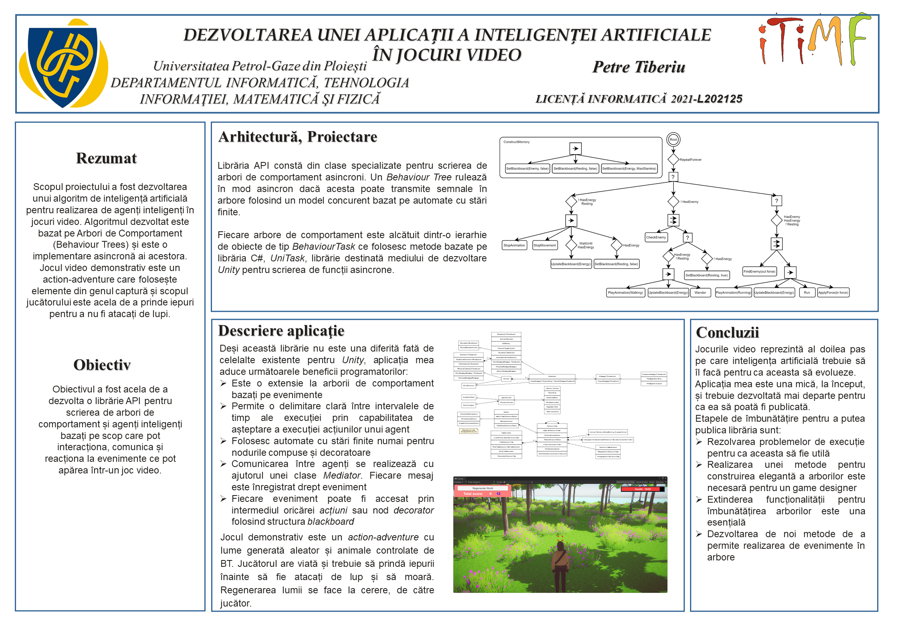

# 
EvoAgents - Rabbit Catcher

## 
Developing an artificial intelligence based video game

## <i>Introduction</i>

<h3>
This video game was developed as a project for my Bachelor's thesis at University Petroleum-Gas of Ploiesti. 

I've made first and foremost, an algorithm for artificial intelligence based on Behaviour Trees. It is an asynchronous implementation of a Behaviour Tree using UniTask as a library. The scope of the algorithm was implementing an evaluation method of a tree based on asynchronous calls of the action nodes.

The game is an action-adventure in which the world is randomly generated using Perlin Noise and Mesh Manipulation (Voxel style terrain). The player finds rabbits and wolfs which has their intelligence based on a Behaviour Tree implemented using my algorithm. You must catch all the rabbits before they get attacked by wolfs and die. On death, you lose the game.
</h3>